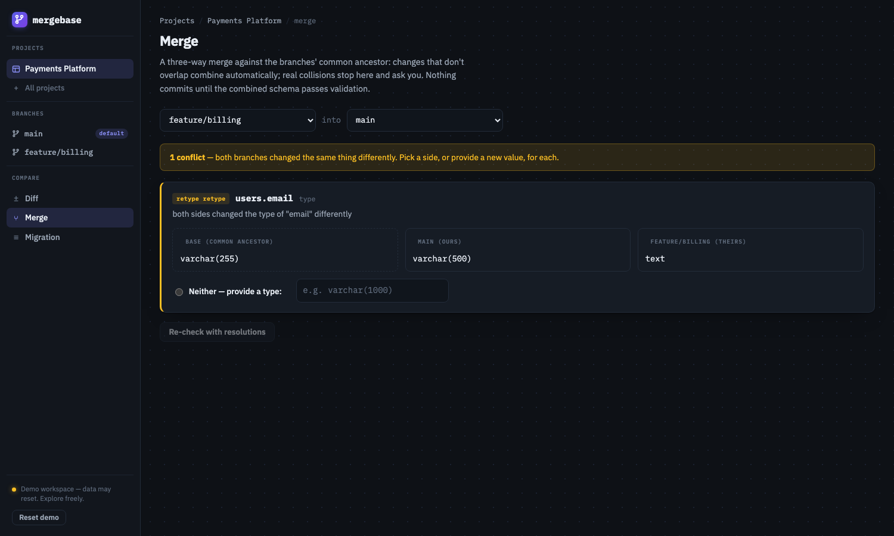
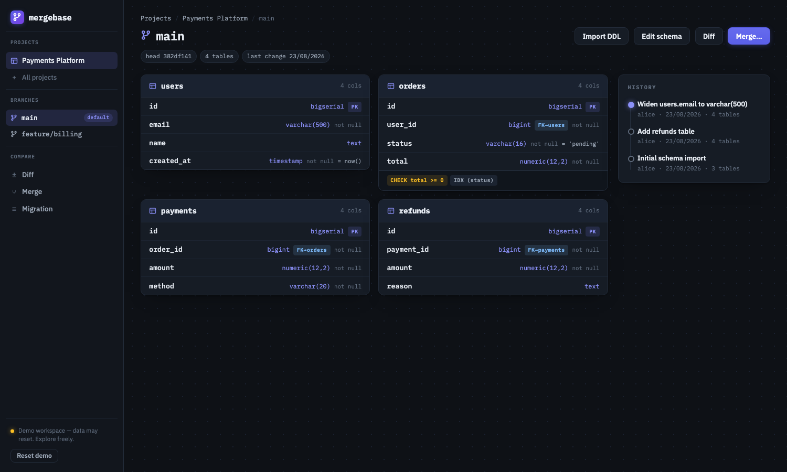

# Mergebase

[](https://github.com/rohithmone27/mergebase/actions/workflows/ci.yml)

**Version control for database schemas** — branch a schema, evolve branches
independently, see exactly what diverged, and merge back safely with conflict
resolution, whole-schema validation, and an ordered migration script.

**Live demo: <https://mergebase.onrender.com>** — opens on a seeded workspace
with a merge conflict already waiting.



*Both branches retyped `users.email` differently. Everything else merged on its
own; this one stops and asks — ours, theirs, or a value neither side proposed.*



Your code lives in Git; the database schema everything stands on usually
doesn't. Two people change it in parallel and reconcile by hand. Mergebase
gives the schema the same safety net Git gives code — the versioned artifact
is the schema itself (PostgreSQL dialect), not SQL files and not row data.

Every design call made while building this — what was chosen, what was
rejected, what was deliberately cut — is logged in **[decisions.md](decisions.md)**.

## What it does

- **Import** a schema (paste PostgreSQL DDL) → it becomes a versioned,
  immutable snapshot. Constructs outside the supported subset are **recorded,
  never silently dropped** — import warns and export states its coverage.
- **Branch** and evolve independently: add / drop / **rename** / retype
  columns, change constraints and indexes, create / drop tables. Every edit
  preserves object identity — a rename is *the same object with a new name*.
- **Diff** any two branches or commits — semantically: "column `email`
  renamed and retyped", never a wall of red/green text lines.
- **Merge** with a true **three-way merge** against the common ancestor.
  Non-overlapping changes combine automatically; real collisions become
  conflicts resolved as *ours*, *theirs*, or *provide-a-value* (some
  conflicts — two renames landing on one name — have no side to pick).
- **Validate**: a merge only commits if the combined schema is coherent.
  Conflict detection finds where branches disagree; validation finds where
  their agreement is still broken (an FK at a table the other side dropped).
- **Export**: download any branch's schema as PostgreSQL DDL, with a header
  stating exactly which constructs the model does not carry.
- **Migrate**: get ordered DDL that carries one version to the other —
  phase-ordered (cycle-proof, even for circular foreign keys), renames stay
  renames so data survives, and data-dependent hazards are flagged as
  explicit warnings. **Generated, never executed** — Mergebase never touches
  a real database.

## Run it

```sh
docker compose up          # then open http://localhost:8080
```

or, without Docker (Go 1.25+, Node 20+):

```sh
cd web && npm install && npm run build && cd ..
go run ./cmd/server        # http://localhost:8080
```

Configuration is two variables: `PORT` (default 8080) and `DATABASE_PATH`
(default `./data/mergebase.db` — a single SQLite file; no database server).
First boot with an empty database seeds a demo workspace: a payments schema
with two diverged branches and one prepared merge conflict, so the
interesting state is one click away. **Reset demo** in the header restores it.

## The three-minute tour

1. Open **Payments Platform** → branches `main` and `feature/billing` have
   diverged from a shared commit.
2. **Diff** them: refunds added on one side, invoices on the other, a column
   renamed (`name → full_name`), and `users.email` retyped on *both* sides.
3. **Merge feature/billing into main**: everything combines automatically
   except the email retype — `varchar(500)` vs `text`, a true conflict.
   Pick a side (or type a third answer).
4. Merge lands as a two-parent commit; validation confirms no dangling
   references; the **migration script** is one click away, with the one
   data-dependent warning it deserves.
5. Try to break it: edit schemas, paste your own DDL (rename detection will
   ask before guessing), then **Reset demo** for the next person.

## Architecture

```
Browser (React/TS) ── JSON ──► Go HTTP server (thin API layer)
                                      │
                    pure engine packages (no HTTP, no storage):
          parser · diff · merge · validate · migrate · match · ops
                                      │
                          SQLite — one file (snapshots, branches, events)
```

- **Identity backbone:** every table/column carries a stable ID that survives
  renames; constraints and indexes reference objects **by ID**, never by
  name. This single decision is what makes rename-aware diff and merge exact
  instead of guessed.
- **Commits** are whole-schema snapshots forming a DAG (merge commits have
  two parents). Branches are named pointers; heads move only by
  compare-and-swap inside the commit transaction, so concurrent writers
  cannot silently clobber each other.
- **Merge-base** is a deterministic BFS LCA — the same merge always sees the
  same ancestor, criss-cross histories included.
- One process, one state file, one Docker container. Nothing external to be
  down while you're using it.

## Seven invariants (enforced by the test suite)

1. A commit's snapshot is immutable — history never rewrites.
2. A branch head always points at an existing commit.
3. The merge-base is selected deterministically.
4. A merge produces a commit **only** if the merged schema passes validation.
5. `apply(migration(A → B), A) ≡ B` at the schema level; data-dependent
   failures are surfaced as explicit warnings, not pretended away.
6. Object identity survives renames — through diff, merge, and migration.
7. Re-import matches against the branch's own head, never from scratch —
   an identical re-import merges against a sibling with **zero** conflicts.

## Tests

```sh
go test ./...
```

Eleven packages, with the depth where the risk lives. Alongside the
example-based suites there are **property-based tests**: 1,200 randomized
merges asserting four universal claims — fast-forward is identity, identical
edits never conflict, every resolved merge is deterministic and passes
validation, and disjoint edits only conflict through a global namespace.
(That last property was initially stated too strongly and the engine was
right: table and index names are global, so edits to *different* tables can
still collide. See decisions.md #17.) Plus the conflict taxonomy
tested in both directions (each class has a must-conflict case and an
adjacent must-merge-cleanly case), migration phase-ordering proofs including
circular FKs and rename swaps, parser fidelity goldens, storage CAS races,
and API journey tests that drive seed → diff → conflict → resolve → merge →
migration end to end. The UI is verified by scripted real-browser runs of
the full journey (see decisions.md #15 for the honest trade-off).

## Supported PostgreSQL subset

Tables, columns (types with parameters, NOT NULL, defaults), primary keys,
foreign keys (with ON DELETE / ON UPDATE actions), unique constraints,
CHECK constraints (expressions compared textually), and indexes
(multi-column, DESC, UNIQUE, USING method) — via `CREATE TABLE`,
`CREATE INDEX`, and `ALTER TABLE ADD COLUMN / ADD CONSTRAINT`.

Outside the subset (views, triggers, sequences, partitions, collations,
partial/expression indexes, …): parsed, **reported per commit**, and stated
on export — never silently lost. The subset is a documented boundary, not a
gap you discover later.

## API

```
POST /api/projects                        create (optional DDL → first commit)
GET  /api/projects · /api/projects/{id}
POST /api/projects/{id}/branches          {name, from}
GET  /api/branches/{id}/schema · /commits
POST /api/branches/{id}/changes           {operations[], message} → commit
POST /api/branches/{id}/import            {ddl} → rename proposals → confirm → commit
GET  /api/diff?from=&to=                  semantic diff (branch or commit refs)
POST /api/merge/preview · /api/merge      three-way merge; 409 on unresolved/invalid
GET  /api/migration?from=&to=[&format=sql]
POST /api/demo/reset · GET /healthz
```

Every error is `{code, message, hint}` with a hint you can act on.
